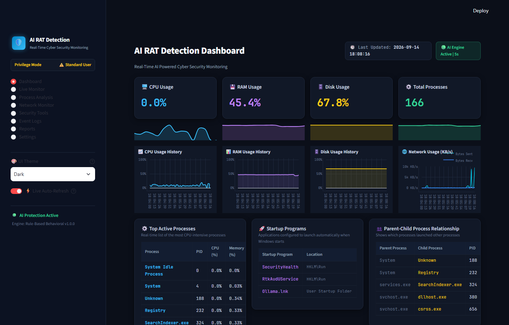
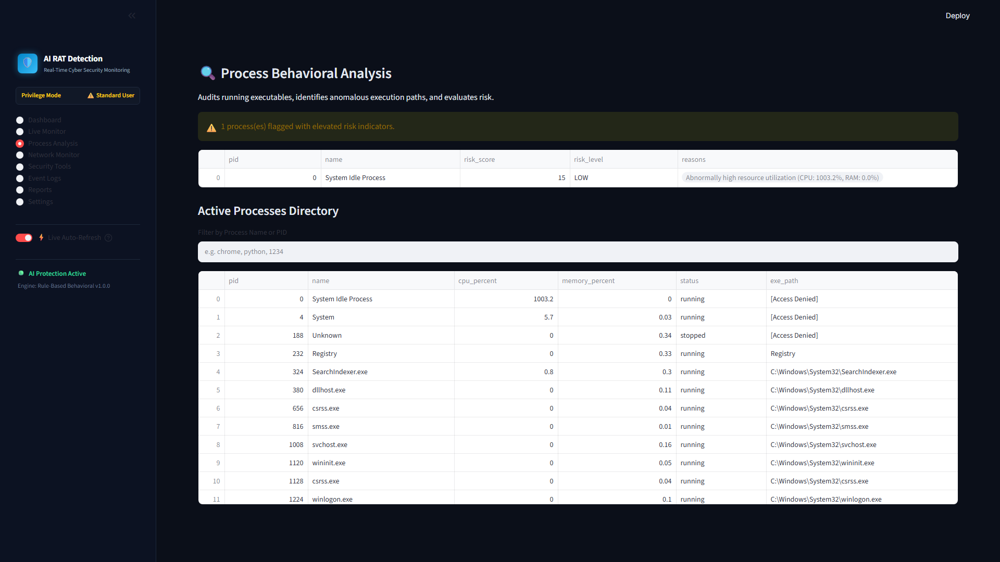
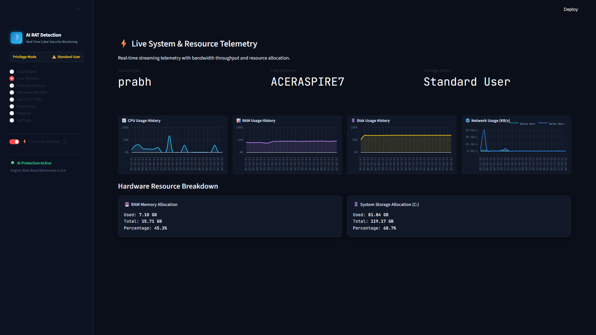
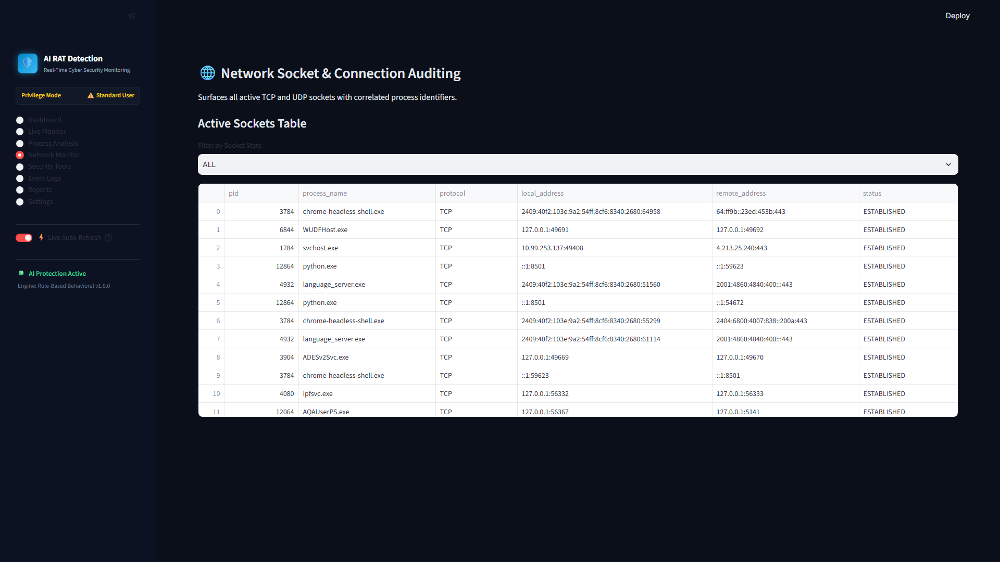
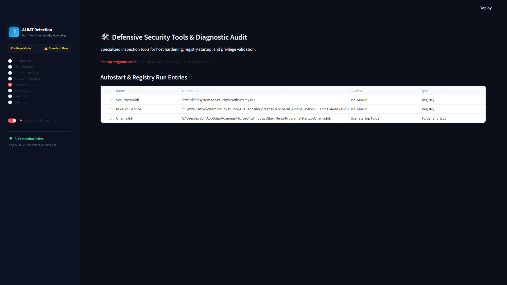
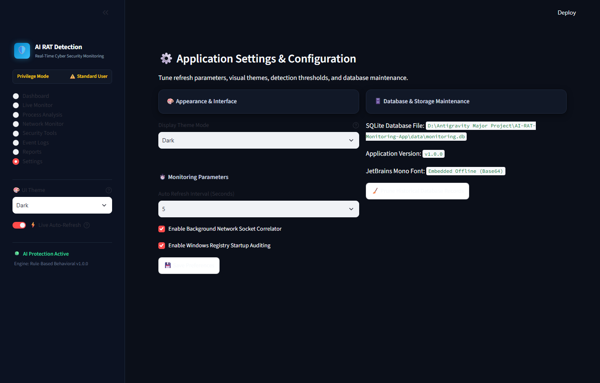

# AI RAT Detection Dashboard

[](LICENSE)
[](https://www.python.org/)
[](https://github.com/)
[](.github/workflows/tests.yml)
[](Windows/Portable/)

A production-ready, cross-platform host cybersecurity auditing suite and **Remote Access Trojan (RAT)** behavioral detection dashboard. Designed for security analysts, incident responders, and system administrators, the application delivers real-time hardware telemetry, process execution hierarchy audits, suspicious socket detection, defensive peripheral auditing, and automated forensic incident reporting.

The dashboard runs as a native standalone desktop application powered by `pywebview`, completely offline, with **zero external AI or cloud runtime dependencies**.

---

## Table of Contents
- [Key Features](#key-features)
- [Architecture & Master Codebase](#architecture--master-codebase)
- [Screenshots](#screenshots)
- [Pre-Built Distributions](#pre-built-distributions)
- [Quickstart (Run from Source)](#quickstart-run-from-source)
- [Building Packages from Source](#building-packages-from-source)
- [Development Workflows](#development-workflows)
  - [AI-Assisted Workflow](#ai-assisted-workflow)
  - [Non-AI / Manual Workflow](#non-ai--manual-workflow)
- [Detection Limitations & Disclaimer](#detection-limitations--disclaimer)
- [Automated Verification](#automated-verification)
- [Contributing](#contributing)
- [Security Policy](#security-policy)
- [License](#license)

---

## Key Features

### 1. Real-Time Hardware & Telemetry Engine
- **Non-Blocking Telemetry**: Decoupled multi-threaded background worker with tiered collection intervals and microsecond caching.
- **Ultra-Low CPU Overhead**: Verified real-life OS CPU consumption of **< 1% at idle**, preventing monitoring tools from exhausting host resources.
- **Hardware Metrics**: Real-time tracking of CPU usage, RAM utilization, physical disk throughput, network adapter bandwidth, and GPU statistics.

### 2. Process Tree & Behavioral Anomaly Detection
- **Process Hierarchy Analysis**: Full inspection of parent-child relationships, command-line arguments, and process hashes.
- **RAT Heuristics**: Detection of masqueraded executables, headless interpreters, hollowed binaries, suspicious working directories, and abnormal child-process spawning (e.g. `cmd.exe` or `powershell.exe` spawned by Word, Excel, or PDF readers).

### 3. Network Socket Forensics
- **Active Connection Auditing**: Real-time enumeration of TCP/UDP connections across all endpoints (`ESTABLISHED`, `LISTEN`, `SYN_SENT`).
- **C2 & Beaconing Analysis**: Detection of reverse shells, high-frequency socket reconnection loops, abnormal port bindings, and suspicious remote endpoints.

### 4. Persistence & Startup Verification
- **Windows**: Deep inspection of Registry Run keys (`HKCU` and `HKLM\Software\Microsoft\Windows\CurrentVersion\Run`), Startup folders, Scheduled Tasks, and Winlogon entries.
- **Linux**: Inspection of XDG Autostart specifications (`~/.config/autostart`, `/etc/xdg/autostart`), systemd user services, and cron configurations.

### 5. Automated Forensic Incident Reporting
- **Executive PDF Generation**: Standalone, one-click PDF generation using `reportlab`, complete with high-severity alerts, process tables, network sockets, and remediation guidelines.
- **Structured CSV Export**: Instant table exports for integration with external SIEM, ELK, or incident ticket workflows.

### 6. Modern Desktop UI
- **Native Window Experience**: Full native desktop window powered by `pywebview` (Windows WebView2 / Linux WebKit2GTK) without browser chrome or manual URL entry.
- **Dynamic Theming**: Seamless switching between Obsidian Dark and Clean Light themes.
- **Offline Typography**: Fully embedded JetBrains Mono fonts for complete offline air-gapped security environments.

---

## Architecture & Master Codebase

The repository strictly adheres to a clean, isolated **three-folder architecture**:

```text
AI-RAT-Detection-Dashboard/
│
├── Core/                               # SINGLE MASTER SOURCE CODEBASE
│   ├── app.py                          # Streamlit UI application entrypoint
│   ├── desktop_app.py                  # Standalone native desktop container (pywebview)
│   ├── build_windows.py                # Windows Portable & Inno Setup installer builder
│   ├── build_linux.py                  # Linux AppImage & Debian package builder
│   ├── requirements.txt                # Production Python dependencies
│   ├── assets/                         # Application icons, logos, and bundled offline fonts
│   │   ├── icon.ico                    # Windows icon
│   │   ├── icon.png                    # Linux / Freedesktop icon
│   │   └── fonts/                      # Offline JetBrains Mono font family (Regular & Bold)
│   ├── platforms/                      # Hardware & OS abstraction layer
│   │   ├── base.py                     # BasePlatformAdapter interface
│   │   ├── windows.py                  # Windows Registry, UAC, GPU & sensor adapter
│   │   └── linux.py                    # Linux XDG Autostart, DRM/sysfs GPU & rootless sensor adapter
│   ├── monitoring/                     # Hardware, process, socket & startup collectors
│   ├── detection/                      # Multi-layer behavioral and heuristic threat engines
│   ├── services/                       # Decoupled background telemetry coordinator & PDF reports
│   ├── ui/                             # Dashboard views, cards, charts, and CSS theme engine
│   ├── database/                       # Embedded SQLite storage with automatic pruning
│   ├── config/                         # Configuration and persistent settings manager
│   ├── utils/                          # Formatting, elevation, and helper utilities
│   └── tests/                          # Automated pytest suite (33+ tests)
│
├── Windows/                            # WINDOWS PRODUCTION BUILDS ONLY
│   ├── Portable/
│   │   ├── AI-RAT-Detection-Dashboard.exe      # Self-contained portable binary
│   │   ├── Launch-AI-RAT-Detection-Dashboard.bat # One-click shell launcher
│   │   └── AI-RAT-Detection-Dashboard-Windows-x64.zip # Distributable archive
│   └── Installer/
│       ├── AI-RAT-Detection-Dashboard-Setup.exe  # Inno Setup Windows installer
│       └── installer.iss                       # Inno Setup build script
│
└── Linux/                              # LINUX PRODUCTION BUILDS ONLY
    ├── AppImage/
    │   ├── AI-RAT-Detection-Dashboard.AppImage # Distributable standalone AppImage
    │   ├── build_appimage.sh                   # AppImage bundle script
    │   └── AppDir/                             # Self-contained Freedesktop AppDir bundle
    └── Debian/
        ├── ai-rat-detection-dashboard.deb      # Debian/Ubuntu package
        ├── build_deb.sh                        # Debian package builder
        └── package/                            # Debian control and system hierarchy
```

> **Strict Architectural Rule**: `Core/` is the **single master source of truth**. All future modifications, fixes, and features must be applied strictly inside `Core/`. The `Windows/` and `Linux/` directories are release outputs generated by their respective build pipelines.

---

## Screenshots

| Overview Dashboard (Dark) | Process Analysis View |
| :---: | :---: |
|  |  |

| Live Monitoring Telemetry | Network Socket Forensics |
| :---: | :---: |
|  |  |

| Security Tools & Persistence | Settings & Theme Customization |
| :---: | :---: |
|  |  |

---

## Pre-Built Distributions

Pre-compiled production binaries are provided directly in the repository:

### Windows (x64)
- **Windows Setup Installer**: [`Windows/Installer/AI-RAT-Detection-Dashboard-Setup.exe`](Windows/Installer/)
  - Standard Windows wizard installer.
  - Automatically creates Start Menu shortcuts and optional Desktop icons.
  - Includes a clean uninstaller accessible via Windows Settings / Add or Remove Programs.
- **Windows Portable Edition**: [`Windows/Portable/AI-RAT-Detection-Dashboard.exe`](Windows/Portable/)
  - Zero-installation executable.
  - Ideal for USB forensic kits and air-gapped triage machines.
- **Windows Distributable ZIP**: [`Windows/Portable/AI-RAT-Detection-Dashboard-Windows-x64.zip`](Windows/Portable/)
  - Full portable bundle ready for network distribution.

### Linux (x86_64)
- **Debian / Ubuntu Package**: [`Linux/Debian/ai-rat-detection-dashboard.deb`](Linux/Debian/)
  - Installs cleanly to `/opt/ai-rat-detection-dashboard` with `/usr/bin` symlink and desktop menu integration.
  - Install via `sudo dpkg -i ai-rat-detection-dashboard.deb`.
- **AppImage Package**: [`Linux/AppImage/AI-RAT-Detection-Dashboard.AppImage`](Linux/AppImage/)
  - Standalone single-file executable for all major Linux distributions (Ubuntu, Fedora, Arch, Debian).
  - Make executable and run: `chmod +x AI-RAT-Detection-Dashboard.AppImage && ./AI-RAT-Detection-Dashboard.AppImage`.

---

## Quickstart (Run from Source)

### Prerequisites
- **Python**: 3.10, 3.11, 3.12, 3.13, or 3.14
- **Operating System**: Windows 10/11 or modern Linux (Ubuntu 20.04+, Debian 11+, Fedora 36+)

### 1. Clone & Set Up Environment
```bash
git clone https://github.com/<your-username>/ai-rat-detection-dashboard.git
cd ai-rat-detection-dashboard/Core

# Create a virtual environment
python -m venv .venv

# Activate on Windows:
.\.venv\Scripts\activate

# Activate on Linux/macOS:
source .venv/bin/activate

# Install dependencies
pip install -r requirements.txt
```

### 2. Launch the Application

#### Option A: Native Desktop App (Recommended)
```bash
# Windows
.\run_app.bat

# Linux / Unix
chmod +x run_app.sh
./run_app.sh

# Or directly with Python:
python desktop_app.py
```

#### Option B: Browser Mode (Streamlit Direct)
```bash
python -m streamlit run app.py
```

---

## Building Packages from Source

All builds are compiled strictly from `Core/` and write outputs directly into `Windows/` and `Linux/`.

### Building Windows Executable & Installer
Ensure PyInstaller and Inno Setup 6 are installed, then run:
```bash
cd Core
python build_windows.py
```
This automatically:
1. Validates all prerequisite assets and local fonts.
2. Compiles `desktop_app.py` into `Windows/Portable/AI-RAT-Detection-Dashboard.exe`.
3. Packages the portable distributable zip.
4. Generates a portable `installer.iss` and invokes the Inno Setup compiler (`ISCC.exe`) to build `Windows/Installer/AI-RAT-Detection-Dashboard-Setup.exe`.

### Building Linux Packages
Ensure Python 3 and basic build tools are installed, then run:
```bash
cd Core
python build_linux.py
```
This automatically:
1. Builds the Freedesktop `AppDir` bundle and generates `Linux/AppImage/AI-RAT-Detection-Dashboard.AppImage`.
2. Assembles the Debian package directory structure and compiles `Linux/Debian/ai-rat-detection-dashboard.deb`.

---

## Development Workflows

### AI-Assisted Workflow
Contributors using AI coding assistants (e.g., GitHub Copilot, Google Gemini, Claude, Cursor) should follow these conventions:
- **Zero Runtime Dependencies**: AI tools may be used during authoring, refactoring, and test design, but the resulting codebase must never require AI runtime dependencies (no external LLM API calls, no local Ollama servers, no cloud inference).
- **Defensive API Standards**: When prompting AI assistants to add monitoring hooks, require defensive exceptions for `psutil.AccessDenied`, `psutil.NoSuchProcess`, and permission checks across Windows and Linux.
- **Architectural Isolation**: Instruct AI assistants to never commit changes directly into `Windows/` or `Linux/`; all modifications must originate in `Core/`.

### Non-AI / Manual Workflow
Developers contributing without AI tools follow standard open-source Python engineering:
1. **Rule Authoring**: Detection rules are defined declaratively in `Core/detection/rules.py` with explicit severity ratings, MITRE ATT&CK mappings, and validation predicates.
2. **Platform Adapters**: Hardware-specific calls must be placed in `Core/platforms/windows.py` or `Core/platforms/linux.py`, inheriting from `Core/platforms/base.py`.
3. **Telemetry Benchmarking**: When modifying `monitoring_service.py`, always measure CPU consumption before and after changes to guarantee the engine remains under the 10% CPU threshold.

---

## Detection Limitations & Disclaimer

> [!WARNING]
> **DEFENSIVE AUDITING AND EDUCATIONAL NOTICE**
> The AI RAT Detection Dashboard is designed as a host monitoring, behavioral analysis, and threat research platform.

Please be aware of the following technical limitations:
1. **Heuristic Nature**: Detections are based on behavioral heuristics, process hierarchy abnormalities, and socket states. Legitimate developer tools, administrative scripts, VPN software, or remote management software (e.g., TeamViewer, AnyDesk, SSH) may trigger informational alerts (false positives).
2. **User-Space Operation**: The dashboard operates in user space utilizing standard operating system APIs and `psutil`. It does not utilize kernel drivers, kernel callbacks, or ring-0 hooks. Consequently, advanced rootkits or kernel-level malware that intercept OS API calls may evade detection (false negatives).
3. **Not an Antivirus Replacement**: This software is not intended to replace enterprise Endpoint Detection and Response (EDR) platforms or certified antivirus engines. It should be used as a complementary host auditing, telemetry, and forensic analysis tool.

---

## Automated Verification

The project includes an automated test suite covering all critical monitoring, detection, database, and reporting modules.

```bash
cd Core
pytest tests/ -v
```

### Verified Test Coverage (33/33 Tests Passing):
- `tests/test_alert_service.py`: Alert creation, severity thresholding, and broadcast callbacks.
- `tests/test_config.py`: Configuration persistence, default values, and environment overrides.
- `tests/test_database.py`: SQLite schema initialization, alert retention, telemetry persistence, and automatic pruning.
- `tests/test_detection.py`: Behavioral heuristics, process masquerading rules, and reverse shell detection.
- `tests/test_monitoring.py`: Hardware metrics collection, tiered background caching, and socket enumeration.
- `tests/test_platforms.py`: Windows and Linux platform abstraction interfaces and rootless fallback mechanisms.
- `tests/test_report_service.py`: ReportLab PDF rendering, executive summaries, and CSV export validity.

---

## Contributing

We welcome contributions from the community! Please read our [Contributing Guidelines](CONTRIBUTING.md) and [Code of Conduct](CODE_OF_CONDUCT.md) before submitting pull requests.

To contribute:
1. Fork the repository.
2. Create a feature branch (`git checkout -b feature/new-capability`).
3. Implement your changes inside `Core/`.
4. Ensure all tests pass with `pytest tests/ -v`.
5. Submit a detailed Pull Request.

---

## Security Policy

For vulnerability reporting guidelines and our security posture, please review our [Security Policy](SECURITY.md). Please do not disclose vulnerabilities through public GitHub issues.

---

## License

This project is licensed under the [MIT License](LICENSE) &copy; 2026 AI RAT Detection Dashboard Project Contributors.
